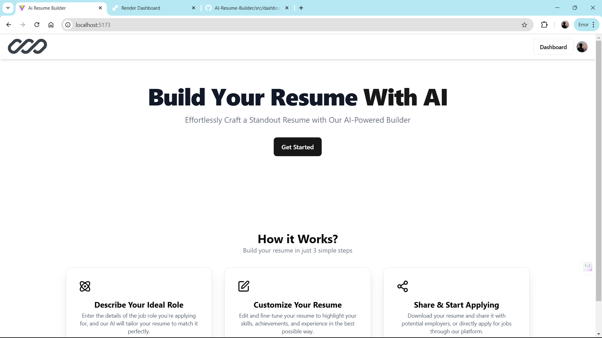

# AI Resume Builder

AI Resume Builder is a web-based application that helps users effortlessly create professional resumes. The app provides features such as adding professional experience, education, skills and customizing the layout using various themes. It also includes capabilities like editing, deleting and downloading resumes.

---

## Screenshots

### Home Screen
This is the landing page of the application.



## Features

- **Dynamic Resume Creation**: Add, update and delete professional experience, skills and educational qualifications.
- **Theming**: Customize your resume with gradient themes and dynamic colors.
- **Preview & Download**: Preview and download resumes in various formats.
- **API Integration**: Uses Strapi for backend management.
- **Responsive Design**: Works seamlessly across devices.

---

## Tech Stack

- **Frontend**: React, Tailwind CSS
- **Backend**: Strapi
- **Additional Libraries**:
  - `react-router-dom` for routing
  - `axios` for API calls
  - `lucide-react` for icons
  - `sonner` for notifications

---

## Prerequisites

Before running the project, ensure you have the following installed:

- **Node.js** (version >= 16.0)
- **npm** or **yarn**
- **Strapi** for backend (check its setup below)

---

## Installation and Setup

### Clone the Repository

```bash
git clone https://github.com/your-username/ai-resume-builder.git
cd ai-resume-builder
