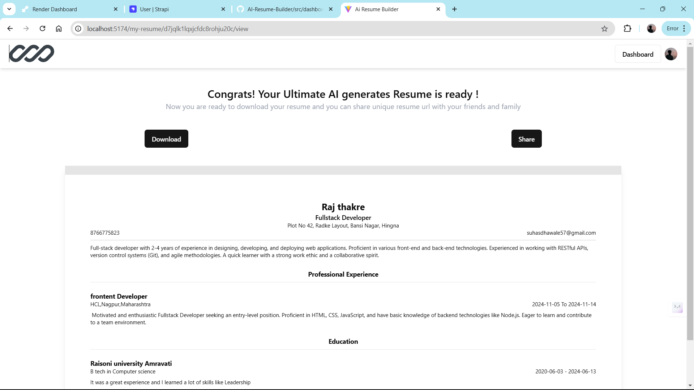

# AI Resume Builder

AI Resume Builder is a web-based application that helps users effortlessly create professional resumes. The app provides features such as adding professional experience, education, skills and customizing the layout using various themes. It also includes capabilities like editing, deleting and downloading resumes.

---

## Screenshots

### Home Screen
This is the landing page of the application.


### Resume List
Displays all resumes created by the user.


### Resume Editor
Edit and customize resumes with multiple options like Personal Details, Summary, Professional Experience, Education Details and Skills.


### Download & Share Resume
Shows the download and share options.



## Features

- **Dynamic Resume Creation**: Add, update and delete professional experience, skills and educational qualifications.
- **AI Tools**: Generate Summary and experience details using AI.
- **Theming**: Customize your resume with gradient themes and dynamic colors.
- **Preview & Download**: Preview and download resumes in various formats.
- **API Integration**: Uses Strapi for backend management.
- **Responsive Design**: Works seamlessly across devices.

---

## Tech Stack

- **Frontend**: React, Tailwind CSS
- **Backend**: Strapi
- **Additional Libraries**:
  - `react-router-dom` for routing
  - `axios` for API calls
  - `lucide-react` for icons
  - `sonner` for notifications

---

## Prerequisites

Before running the project, ensure you have the following installed:

- **Node.js** (version >= 16.0)
- **npm** or **yarn**
- **Strapi** for backend (check its setup below)

---

## Installation and Setup

### Clone the Repository

```bash
git clone https://github.com/SuhasDhawale/Ai-Resume-Builder.git
cd Ai-Resume-Builder
```

### Setup Environment Variables

Create a .env file in the project root with the following variables:

```bash
VITE_CLERK_PUBLISHABLE_KEY=Your_Clerk_key

VITE_STRAPI_API_KEY=Your_Strapi_api_key

VITE_GOOGLE_AI_API_KEY=Your_google_gemini_api_key

VITE_BASE_URL=Your_backend_server_url
```

### Install Dependencies

```bash
npm install
```

### Run the Frontend

```bash
npm run dev
```

The application will be available at http://localhost:5173.

---

## Backend (Strapi) Setup

1. Install Strapi globally:

```bash
npm install -g create-strapi-app
```

2. Create a new Strapi project or clone your existing Strapi backend:

```bash
npx create-strapi-app backend --quickstart
```

3. Configure the content types and endpoints for user-resumes.

4. Generate an API key from Strapi Admin and use it in the .env file.

5. Start Strapi:

```bash
cd backend
npm run develop
```

Strapi will run at http://localhost:1337.

---

## Project Structure

```bash
src/
├── components/         # Reusable UI components
├── pages/              # Application pages
├── services/           # API services
├── assets/             # Static assets (images, icons)
└── App.jsx             # Main entry point
```

---
## How to use 

1. Navigate to the app's homepage.
2. Click on "Create Resume."
3. Add details like skills, experience, and education.
4. Save your resume and choose a theme.
5. Preview or download the resume.
---

## Contributions

Contributions are welcome! Feel free to fork the repository and submit pull requests. For major changes, please open an issue to discuss what you would like to change.

